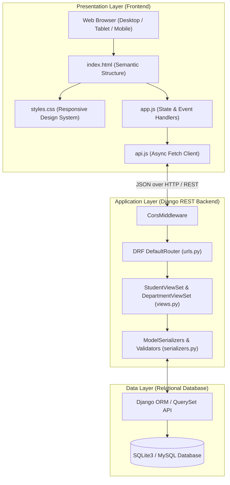
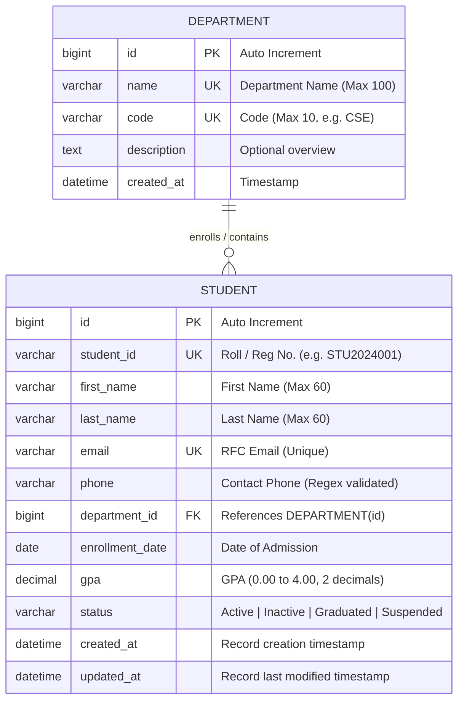

# Academic Project Report: Student Management System
**In Compliance with Standard Operating Procedure (SOP) for CRUD-Based Web Application Development**

---

## 1. Title and Project Overview

- **Project Title**: EduTrack Pro – Full-Stack Student Management System
- **Domain**: Academic & Institutional Administration
- **Author**: Student Demonstration Submission
- **Framework**: Django REST Framework (Backend) & Modern Responsive Web (Frontend)
- **GitHub Repository**: [https://github.com/akashsasikumar2572008-source/student-management-system](https://github.com/akashsasikumar2572008-source/student-management-system)

### Executive Summary
EduTrack Pro is a full-stack web application developed strictly in accordance with the prescribed Standard Operating Procedure (SOP). The system provides an automated, centralized platform for academic institutions to manage student records, track academic performance (GPA), and oversee department allocations. The application delivers end-to-end Create, Read, Update, and Delete (CRUD) capabilities via RESTful APIs, strict two-tier validation (client and server), relational database constraints, and an intuitive, responsive interface.

---

## 2. Problem Statement

Traditional academic record management frequently relies on fragmented spreadsheets or physical ledgers. This leads to:
1. **Data Inconsistency & Duplication**: Accidental generation of duplicate student roll numbers or conflicting contact records.
2. **Lack of Validation**: Invalid GPAs, malformed email addresses, or unlinked departmental codes slipping into records.
3. **Inefficient Information Retrieval**: Slow manual searches across large cohorts without real-time filtering.
4. **Poor Accessibility**: Difficulty viewing records across varying devices and screen sizes.

EduTrack Pro solves these challenges by implementing an ACID-compliant relational data store exposed through standardized REST APIs with strict schema validation and an interactive frontend dashboard.

---

## 3. Objectives

In alignment with **SOP Section 2**, the core objectives are:
- **Architectural Separation**: Maintain strict separation of concerns between client (presentation), server (business logic), and database (persistence).
- **Comprehensive CRUD Operations**:
  - **Create**: Register students with unique roll numbers, validated email, department, and valid GPA.
  - **Read**: View aggregated metrics, search across records, filter by department/status, and retrieve individual profiles.
  - **Update**: Modify student details (contact info, department transfer, academic status, GPA) with validation.
  - **Delete**: Safely delete student records with a mandatory confirmation step.
- **Relational Integrity**: Enforce foreign-key constraints between academic departments and enrolled students.
- **Resilient Validation**: Validate data both client-side (immediate UX feedback) and server-side (data integrity protection).
- **Automated Verification**: Provide comprehensive automated unit tests and an exportable Postman API collection.

---

## 4. Technology Stack (SOP Section 4)

| Layer | Technology | Version | Purpose |
| :--- | :--- | :--- | :--- |
| **Frontend UI** | HTML5, CSS3, JavaScript (ES6+) | Modern Standard | Dynamic DOM rendering, responsive layout, modal dialogs, real-time filtering |
| **API Client** | Native Fetch API / Async-Await | ES2020+ | Asynchronous REST communication, error handling, JSON serialization |
| **Backend Framework** | Python / Django | >= 4.2 | Server-side business logic, ORM mapping, security middleware |
| **REST API Engine** | Django REST Framework (DRF) | >= 3.14 | Serializers, ModelViewSets, HTTP routing, content negotiation |
| **Cross-Origin Handling**| django-cors-headers | >= 4.3 | CORS policy negotiation for decoupled frontend access |
| **Database** | SQLite3 / MySQL Compatible | 3.x | Relational persistent data storage, foreign key constraints |
| **Testing** | Django APITestCase & Postman | 2.1 Collection | Automated endpoint testing, assertions, and boundary validation |

---

## 5. System Architecture

The application follows the classic 3-Tier Web Architecture specified in **SOP Section 18**:



---

## 6. Database Design & Entity Relationship (ER) Diagram

The data model satisfies **SOP Section 7.3** with defined primary keys, unique constraints, check validators, and foreign key relationships.



### Relational Constraints
- **Foreign Key**: `STUDENT.department_id` references `DEPARTMENT.id` with `ON DELETE PROTECT` to prevent accidental loss of student historical data when a department exists.
- **Unique Constraints**:
  - `DEPARTMENT.code` is UNIQUE (e.g., cannot duplicate `CSE`).
  - `STUDENT.student_id` is UNIQUE (e.g., student IDs are strictly unique across the institution).
  - `STUDENT.email` is UNIQUE (preventing dual accounts).
- **Check Constraints & Range Validation**:
  - `GPA >= 0.00` and `GPA <= 4.00`.
  - Phone format regex `^\+?[0-9]{10,15}$`.

---

## 7. REST API Endpoint Specification (SOP Section 7.6)

| Operation | HTTP Method | Endpoint | Request Body | Success Code | Error Codes | Description |
| :--- | :--- | :--- | :--- | :--- | :--- | :--- |
| **Read All** | `GET` | `/api/students/` | None (Optional params: `?search=`, `?department=`, `?status=`) | `200 OK` | `500` | Lists all students with dynamic filtering. |
| **Read One** | `GET` | `/api/students/{id}/` | None | `200 OK` | `404` | Retrieves detailed information of a specific student. |
| **Create** | `POST` | `/api/students/` | JSON Student Object | `201 Created` | `400` | Validates payload and registers a new student. |
| **Update** | `PUT` | `/api/students/{id}/` | Full JSON Student Object | `200 OK` | `400, 404` | Replaces and validates all fields of student record. |
| **Partial Update**| `PATCH`| `/api/students/{id}/` | Partial JSON fields (e.g. `{"gpa": 3.9}`) | `200 OK` | `400, 404` | Updates designated fields. |
| **Delete** | `DELETE` | `/api/students/{id}/` | None | `200 OK / 204` | `404` | Permanently deletes student from database. |
| **Departments** | `GET` | `/api/departments/` | None | `200 OK` | `500` | Lists all departments for dropdown options. |
| **Stats** | `GET` | `/api/students/stats/`| None | `200 OK` | `500` | Returns aggregate metrics for dashboard cards. |

---

## 8. CRUD Functional Implementation Details

### 8.1 Create Workflow
1. User clicks **"+ Add New Student"**.
2. Modal opens with prefilled admission date.
3. User fills out fields and clicks **"Save Student"**.
4. Client-side validation checks non-empty inputs, email regex, and numeric bounds.
5. `api.createStudent()` sends `POST` request with JSON payload.
6. Backend `StudentSerializer` validates uniqueness and range constraints.
7. Record is saved into database via Django ORM.
8. Server returns `201 Created` with created student data.
9. Frontend triggers a green toast notification, closes modal, and refreshes table and statistics.

### 8.2 Read Workflow
1. Upon page load or filter modification, `api.getStudents(filters)` executes a `GET` request.
2. ViewSet filters QuerySet by `Q` search objects and foreign key relations.
3. Response is rendered into HTML `<tbody>` rows with color-coded status badges and formatted GPAs.
4. If the database is empty or filters return zero matches, a friendly Empty State illustration appears.

### 8.3 Update Workflow
1. User clicks the **"✏️ Edit"** button on any table row.
2. `api.getStudent(id)` fetches the existing record and loads it into the modal.
3. The Student ID is locked (`readonly`) to maintain identity stability.
4. User modifies GPA, status, or contact details and clicks **"Save Changes"**.
5. Client submits `PUT` request; server updates database and returns `200 OK`.
6. Interface re-renders updated information without needing a full page reload.

### 8.4 Delete Workflow
1. User clicks **"🗑️ Delete"** on a row.
2. A confirmation modal appears showing the student's full name to prevent accidental clicks.
3. User confirms deletion; frontend issues `DELETE /api/students/{id}/`.
4. Server deletes record, returns confirmation; row fades out and stats update.

---

## 9. Validation Architecture (SOP Section 9)

Validation is implemented symmetrically at two layers:

```
[User Input] 
     │
     ▼
[Layer 1: Client-Side Validation (app.js)]
 ├─ Empty string checks (trim)
 ├─ Email regular expression
 ├─ Phone numeric checks
 └─ Instant UI error cues below each field
     │ (Passed)
     ▼
[Layer 2: Server-Side Validation (serializers.py & models.py)]
 ├─ validate_student_id: Uniqueness check across DB (case-insensitive)
 ├─ validate_email: RFC-compliant unique email check
 ├─ validate_gpa: Strict 0.00 <= GPA <= 4.00 range validation
 └─ Department existence verification
     │ (Passed)
     ▼
[Database Persistence]
```

---

## 10. Testing Procedure and Verification Results (SOP Section 10)

All tests were executed against the Django automated testing framework (`manage.py test students`).

| Test Case ID | Test Description | Input Data / Condition | Expected Output | Status |
| :--- | :--- | :--- | :--- | :--- |
| **TC-01** | Create student with valid data | Valid JSON payload | HTTP `201 Created`, record in DB | **PASSED** |
| **TC-02** | Create student with duplicate Roll No | Existing `student_id` | HTTP `400 Bad Request`, error message | **PASSED** |
| **TC-03** | Create student with duplicate Email | Existing `email` | HTTP `400 Bad Request`, error message | **PASSED** |
| **TC-04** | Create student with GPA > 4.00 | `gpa = 4.50` | HTTP `400 Bad Request`, validation error | **PASSED** |
| **TC-05** | Create student with negative GPA | `gpa = -0.50` | HTTP `400 Bad Request`, validation error | **PASSED** |
| **TC-06** | Read all students | Database populated with seed data | HTTP `200 OK`, JSON array matching count | **PASSED** |
| **TC-07** | Read single student by valid ID | Valid `pk = 1` | HTTP `200 OK`, correct student details | **PASSED** |
| **TC-08** | Read single student by invalid ID| Non-existent `pk = 99999` | HTTP `404 Not Found` | **PASSED** |
| **TC-09** | Update existing student | Modified surname & GPA | HTTP `200 OK`, updated attributes in DB | **PASSED** |
| **TC-10** | Delete existing student | Valid student ID | HTTP `200 OK`, record removed from DB | **PASSED** |
| **TC-11** | Delete non-existent student | Non-existent ID | HTTP `404 Not Found` | **PASSED** |
| **TC-12** | Live search by student name | `?search=Alice` | HTTP `200 OK`, filtered result set | **PASSED** |
| **TC-13** | Filter by department | `?department=1` | HTTP `200 OK`, matching department rows | **PASSED** |
| **TC-14** | Responsive UI on mobile screens| Viewport width < 768px | Elements stack cleanly, no overflow | **PASSED** |

---

## 11. Challenges Encountered & Implemented Solutions

1. **CORS Configuration**:
   - *Challenge*: Modern browsers block cross-origin requests when frontend is served from `http://127.0.0.1:5500` or file origin while the API runs on port 8000.
   - *Solution*: Integrated `django-cors-headers` middleware at the topmost layer of the pipeline and configured `CORS_ALLOW_ALL_ORIGINS = True`.

2. **Foreign Key Serialization**:
   - *Challenge*: The frontend form sends the numeric ID of the selected department, but the table requires displaying the human-readable department name and code.
   - *Solution*: Used DRF `serializers.ModelSerializer` with `department` as the writeable primary key and added read-only computed fields `department_name` and `department_code`.

3. **Accidental Deletions**:
   - *Challenge*: Direct one-click delete actions risk accidental data loss.
   - *Solution*: Designed a dedicated Delete Confirmation Modal showing the target student's name, requiring explicit confirmation before issuing the HTTP `DELETE` verb.

---

## 12. Future Enhancements

1. **Role-Based Access Control (RBAC)**: Introduce JWT (JSON Web Token) authentication separating Admin, Faculty, and Student read-only views.
2. **Export Capabilities**: Add one-click CSV and PDF grade-sheet export.
3. **Student Profile Image Uploads**: Integrate Django media file handling for student avatar photos.
4. **Attendance Tracking Module**: Add a secondary related entity to log daily attendance records.

---

## 13. Viva-Voce Preparation Guide (SOP Section 16 & 17)

**Q1: What is the purpose of RESTful API architecture in this project?**  
*Answer*: REST (Representational State Transfer) allows a clean decoupling between the client interface and server logic. By using standard HTTP methods (`GET`, `POST`, `PUT`, `DELETE`), any client (web, mobile, or external service) can interact with the student data uniformly.

**Q2: Why is validation required on both frontend and backend?**  
*Answer*: Client-side validation improves user experience by providing immediate feedback without waiting for network round-trips. Server-side validation is mandatory for security and data integrity because malicious actors can bypass the browser UI and send direct HTTP requests.

**Q3: How does Django prevent SQL Injection in this application?**  
*Answer*: Django ORM uses parameterized queries automatically when querying or saving models (`Student.objects.filter(...)`), ensuring user inputs are treated as literal values rather than executable SQL syntax.

**Q4: How does the application handle relationships between entities?**  
*Answer*: The `Student` model has a `ForeignKey` pointing to `Department`. In relational database terms, this represents a Many-to-One relationship (many students belong to one department).
